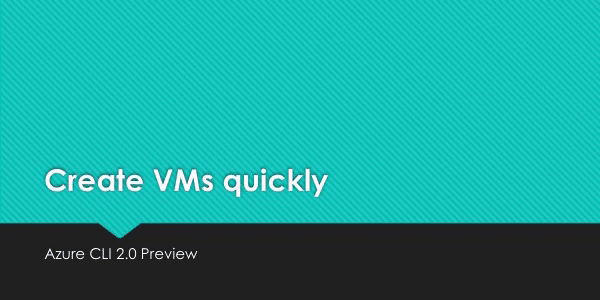

# Microsoft Azure CLI

[](https://pypi.python.org/pypi/azure-cli)
[](https://dev.azure.com/azure-sdk/public/_build/latest?definitionId=246&branchName=dev)
[](https://azurecli.slack.com)

A great cloud needs great tools; we're excited to introduce *Azure CLI*, our next generation multi-platform command line experience for Azure.

Take a test run now from [Azure Cloud Shell](https://portal.azure.com/#cloudshell)!

## Installation

Please refer to the [install guide](https://docs.microsoft.com/cli/azure/install-azure-cli) for detailed install instructions.

A list of common install issues and their resolutions are available at [install troubleshooting](https://github.com/Azure/azure-cli/blob/dev/doc/install_troubleshooting.md).

### Developer installation (see below)

- [Docker](#docker)
- [Edge Builds](#edge-builds)
- [Developer Setup](#developer-setup)

## Usage

```bash
$ az [ group ] [ subgroup ] [ command ] {parameters}
```

### Get Started

Please refer to the ["get started" guide](https://docs.microsoft.com/cli/azure/get-started-with-az-cli2) for in-depth instructions.

For usage and help content, pass in the `-h` parameter, for example:

```bash
$ az storage -h
$ az vm create -h
```

### Highlights

Here are a few features and concepts that can help you get the most out of the Azure CLI.



The following examples are showing using the `--output table` format, you can change your default using the `az configure` command.

#### Tab completion

We support tab-completion for groups, commands, and some parameters

```bash
# looking up resource group and name
$ az vm show -g [tab][tab]
AccountingGroup   RGOne  WebPropertiesRG

$ az vm show -g WebPropertiesRG -n [tab][tab]
StoreVM  Bizlogic

$ az vm show -g WebPropertiesRG -n Bizlogic
```

#### Query

You can use the `--query` parameter and the [JMESPath](http://jmespath.org/) query syntax to customize your output.

```bash
$ az vm list --query "[?provisioningState=='Succeeded'].{ name: name, os: storageProfile.osDisk.osType }"
Name                    Os
----------------------  -------
storevm                 Linux
bizlogic                Linux
demo32111vm             Windows
dcos-master-39DB807E-0  Linux
```

#### Exit codes

For scripting purposes, we output certain exit codes for differing scenarios.

|Exit Code   |Scenario   |
|---|---|
|0  |Command ran successfully.   |
|1   |Generic error; server returned bad status code, CLI validation failed, etc.   |
|2   |Parser error; check input to command line.   |
|3   |Missing ARM resource; used for existence check from `show` commands.   |

### Common scenarios and use Azure CLI effectively

Please check [Tips for using Azure CLI effectively](https://docs.microsoft.com/en-us/cli/azure/use-cli-effectively). It describes some common scenarios:

- [Output formatting (json, table, or tsv)](https://docs.microsoft.com/en-us/cli/azure/use-cli-effectively#output-formatting-json-table-or-tsv)
- [Pass values from one command to another](https://docs.microsoft.com/en-us/cli/azure/use-cli-effectively#pass-values-from-one-command-to-another)
- [Async operations](https://docs.microsoft.com/en-us/cli/azure/use-cli-effectively#async-operations)
- [Generic update arguments](https://docs.microsoft.com/en-us/cli/azure/use-cli-effectively#generic-update-arguments)
- [Generic resource commands - `az resource`](https://docs.microsoft.com/en-us/cli/azure/use-cli-effectively#generic-resource-commands---az-resource)
- [REST API command - `az rest`](https://docs.microsoft.com/en-us/cli/azure/use-cli-effectively#rest-api-command---az-rest)
- [Quoting issues](https://docs.microsoft.com/en-us/cli/azure/use-cli-effectively#quoting-issues)
- [Work behind a proxy](https://docs.microsoft.com/en-us/cli/azure/use-cli-effectively#work-behind-a-proxy)
- [Concurrent builds](https://docs.microsoft.com/en-us/cli/azure/use-cli-effectively#concurrent-builds)

### More samples and snippets

For more usage examples, take a look at our [GitHub samples repo](http://github.com/Azure/azure-cli-samples) or [https://docs.microsoft.com/cli/azure/overview](https://docs.microsoft.com/cli/azure/overview).

### Write and run commands in Visual Studio Code

With the [Azure CLI Tools](https://marketplace.visualstudio.com/items?itemName=ms-vscode.azurecli) Visual Studio Code extension, you can create `.azcli` files and use these features:
- IntelliSense for commands and their arguments.
- Snippets for commands, inserting required arguments automatically.
- Run the current command in the integrated terminal.
- Run the current command and show its output in a side-by-side editor.
- Show documentation on mouse hover.
- Display current subscription and defaults in status bar.
- To enable IntelliSense for other file types like `.ps1` or `.sh`, see [microsoft/vscode-azurecli#48](https://github.com/microsoft/vscode-azurecli/issues/48).


## Data Collection

The software may collect information about you and your use of the software and send it to Microsoft. Microsoft may use this information to provide services and improve our products and services. You may turn off the telemetry as described in the repository. There are also some features in the software that may enable you and Microsoft to collect data from users of your applications. If you use these features, you must comply with applicable law, including providing appropriate notices to users of your applications together with a copy of Microsoft's privacy statement. Our privacy statement is located at https://go.microsoft.com/fwlink/?LinkID=824704. You can learn more about data collection and use in the help documentation and our privacy statement. Your use of the software operates as your consent to these practices.

### Telemetry Configuration

Telemetry collection is on by default. To opt out, please run `az config set core.collect_telemetry=no` to turn it off.

## Reporting issues and feedback

If you encounter any bugs with the tool please file an issue in the [Issues](https://github.com/Azure/azure-cli/issues) section of our GitHub repo.

To provide feedback from the command line, try the `az feedback` command.

\[Microsoft internal] You may contact the developer team via azpycli@microsoft.com.

## Developer installation

### Docker

We maintain a Docker image preconfigured with the Azure CLI.
See our [Docker tags](https://mcr.microsoft.com/v2/azure-cli/tags/list) for available versions.

```bash
$ docker run -u $(id -u):$(id -g) -v ${HOME}:/home/az -e HOME=/home/az --rm -it mcr.microsoft.com/azure-cli:<version>
```

### Edge builds

If you want to get the latest build from the `dev` branch, you can use our "edge" builds.

You can download the latest builds by following the links below:

|      Package      | Link                                       |
|:-----------------:|:-------------------------------------------|
|        MSI        | https://aka.ms/InstallAzureCliWindowsEdge  |
| Homebrew Formula  | https://aka.ms/InstallAzureCliHomebrewEdge |
| Ubuntu Xenial Deb | https://aka.ms/InstallAzureCliXenialEdge   |
| Ubuntu Bionic Deb | https://aka.ms/InstallAzureCliBionicEdge   |
| Ubuntu Focal Deb  | https://aka.ms/InstallAzureCliFocalEdge    |
| Ubuntu Impish Deb | https://aka.ms/InstallAzureCliImpishEdge   |
| Ubuntu Jammy Deb  | https://aka.ms/InstallAzureCliJammyEdge    |
|        RPM        | https://aka.ms/InstallAzureCliRpmEdge      |

You can easily install the latest Homebrew edge build with the following command:

```bash
brew install $(curl -Ls -o /dev/null -w %{url_effective} https://aka.ms/InstallAzureCliHomebrewEdge)
```

You can install the edge build on Ubuntu Xenial with the following command:

```bash
curl -Ls -o azure-cli_xenial_all.deb https://aka.ms/InstallAzureCliXenialEdge && dpkg -i azure-cli_xenial_all.deb
```

And install the edge build with rpm package on CentOS/RHEL/Fedora:

```bash
rpm -ivh --nodeps $(curl -Ls -o /dev/null -w %{url_effective} https://aka.ms/InstallAzureCliRpmEdge)
```

Here's an example of installing edge builds with pip3 in a virtual environment. The `--upgrade-strategy=eager` option will install the edge builds of dependencies as well. 

```bash
$ python3 -m venv env
$ . env/bin/activate
$ pip3 install --pre azure-cli --extra-index-url https://azurecliprod.blob.core.windows.net/edge --upgrade-strategy=eager
```

To upgrade your current edge build pass the `--upgrade` option. The `--no-cache-dir` option is also recommended since
the feed is frequently updated.

```bash
$ pip3 install --upgrade --pre azure-cli --extra-index-url https://azurecliprod.blob.core.windows.net/edge --no-cache-dir --upgrade-strategy=eager
```

The edge build is generated for each PR merged to the `dev` branch as a part of the Azure DevOps Pipelines. 

### Get builds of arbitrary commit or PR

If you would like to get builds of arbitrary commit or PR, see:

[Try new features before release](doc/try_new_features_before_release.md)

## Developer setup

If you would like to setup a development environment and contribute to the CLI, see:

[Configuring Your Machine](https://github.com/Azure/azure-cli/blob/dev/doc/configuring_your_machine.md)

[Authoring Command Modules](https://github.com/Azure/azure-cli/tree/dev/doc/authoring_command_modules)

## Contribute code

This project has adopted the [Microsoft Open Source Code of Conduct](https://opensource.microsoft.com/codeofconduct/).

For more information see the [Code of Conduct FAQ](https://opensource.microsoft.com/codeofconduct/faq/) or contact [opencode@microsoft.com](mailto:opencode@microsoft.com) with any additional questions or comments.

If you would like to become an active contributor to this project please
follow the instructions provided in [Microsoft Open Source Guidelines](https://opensource.microsoft.com/collaborate).
