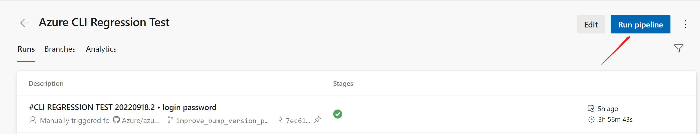
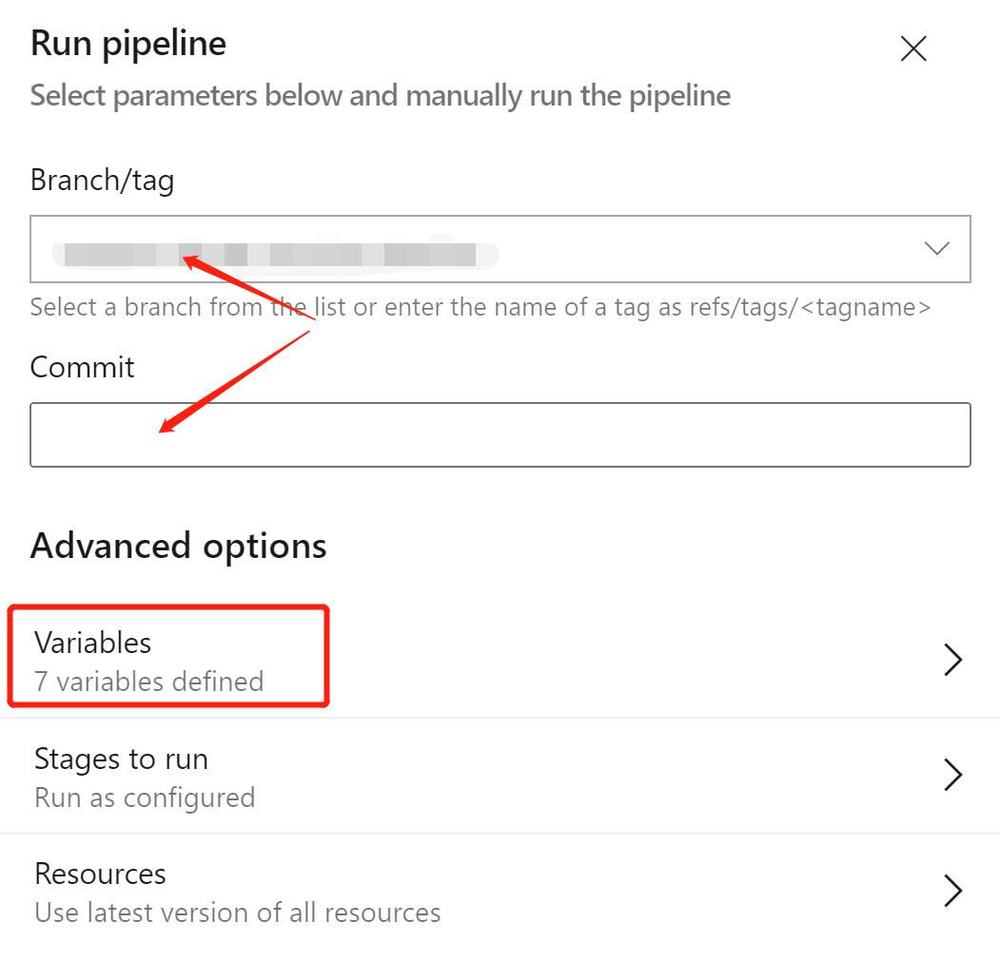
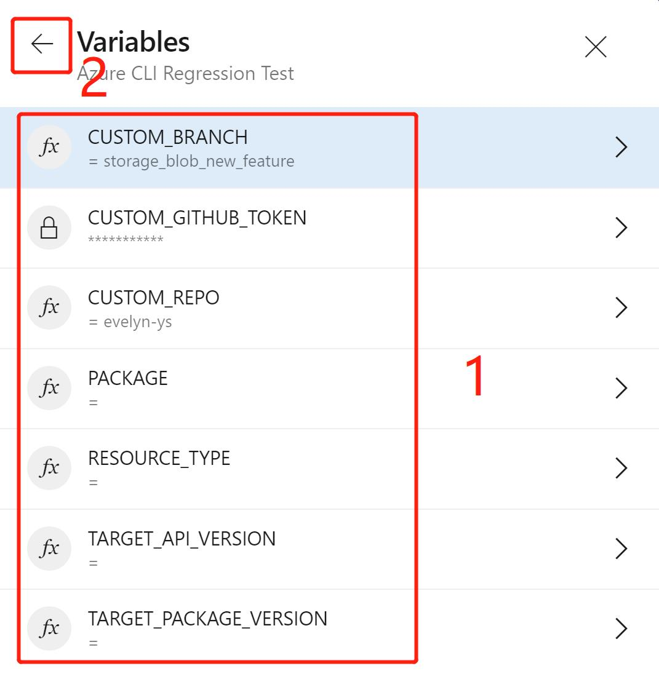
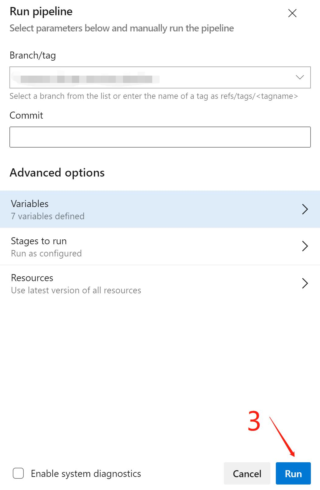

# How to Bump SDK Version in CLI

This article aims to provide a guide for CLI developers and contributors to bump SDK version in Azure CLI.

## Overview

Developers need to do several things for bumping version:
1. Upgrade CLI dependency
    - Upgrade the SDK version in [setup.py](https://github.com/Azure/azure-cli/blob/dev/src/azure-cli/setup.py), [requirements.py3.windows.txt](https://github.com/Azure/azure-cli/blob/dev/src/azure-cli/requirements.py3.windows.txt), [requirements.py3.Linux.txt](https://github.com/Azure/azure-cli/blob/dev/src/azure-cli/requirements.py3.Linux.txt) and [requirements.py3.Darwin.txt](https://github.com/Azure/azure-cli/blob/dev/src/azure-cli/requirements.py3.Darwin.txt)
2. Update the used API version
    - If it's not multi-api SDK, then nothing needed in this step
    - If the SDK contains multiple APIs, the specified API version needs to be updated in CLI Core [AZURE_API_PROFILES](https://github.com/Azure/azure-cli/blob/ce74ae358b51aedfdfb6c32042b515d949618e33/src/azure-cli-core/azure/cli/core/profiles/_shared.py#L147) for 'latest' profile
3. Regression test to check if it breaks existing features
    - Run `azdev test --no-exitfirst` to figure out all test failures in all modules after bumping version
    - Run `azdev test --live --lf --no-exitfirst` to rerun all the failed tests in live mode
    - Tests failed in live run may be affected by breaking changes in new SDK/API version and need to be fixed manually in next step
4. Make the code changes to
    - fix the regression
    - add new features

Considering bumping version is time consuming and most of the work is repetitive, we have `Regression Test Pipeline` to help with step 1-3.

## Regression Test Pipeline

The [Regression Test Pipeline](https://dev.azure.com/azclitools/internal/_build?definitionId=220) is designed to handle all the repetitive work. It will take care of step #1 ~ #3 with a PR created to CLI repo with all code changes and test recordings.

Follow below steps to trigger a new execution of Regression Test Pipeline:

Step 1. Click `Run pipeline` button, leave the `Branch/tag` and `Commit` as it is, open `Variables`

Step 2. Fulfill the variables and run

### Pipeline Variables

Developers can a) update code in your own repo&branch and then leverage this pipeline to do regression test or b) fully rely on pipeline to update versions and then do regression test

For scenario a, variables `CUSTOM_REPO`, `CUSTOM_BRANCH` and `CUSTOM_GITHUB_TOKEN` are used.
For scenario b, variables `PACKAGE`, `TARGET_PACKAGE_VERSION`, `RESOURCE_TYPE` and `TARGET_API_VERSION` are used.
- CUSTOM_REPO: The forked repo name: `https://github.com/{CUSTOM_REPO}/azure-cli/`, eg. `azclibot`, `evelyn-ys`, etc. **Required for scenario a**. Leave it as empty for scenario b.
- CUSTOM_BRANCH: The branch you used in your forked repo to develop features, eg. `dev`, `fix_XXX`, etc. **Required for scenario a**. Leave it as empty for scenario b.
- CUSTOM_GITHUB_TOKEN: Github personal access token which allows commit changes to your repo and branch. See [creating a personal access token](https://docs.github.com/en/authentication/keeping-your-account-and-data-secure/creating-a-personal-access-token). **Required for scenario a**. Leave it as empty for scenario b.
- PACKAGE: The SDK package name, eg. `azure-mgmt-network`. **Required for scenario b**. Leave it as empty for scenario a.
- TARGET_PACKAGE_VERSION: The SDK new version, eg. `19.3.0`. **Required for scenario b**. Leave it as empty for scenario a.
- RESOURCE_TYPE: The resource type enum name define in [CLI Core](https://github.com/Azure/azure-cli/blob/ce74ae358b51aedfdfb6c32042b515d949618e33/src/azure-cli-core/azure/cli/core/profiles/_shared.py#L38), eg. `MGMT_NETWORK`. Required if you want to update the API version definition in CLI Core. Usually used for multi-api SDKs. Leave it as empty for scenario a.
- TARGET_API_VERSION: The new API version(s):
    - If the AZURE_API_PROFILES['latest'][RESOURCE_TYPE] definition is `str` type, then just fulfill this variable with new API version. For example, to update API version for [ResourceType.MGMT_NETWORK](https://github.com/Azure/azure-cli/blob/ce74ae358b51aedfdfb6c32042b515d949618e33/src/azure-cli-core/azure/cli/core/profiles/_shared.py#L150), use `2021-10-01` as variable value.
    - If the  AZURE_API_PROFILES['latest'][RESOURCE_TYPE] definition is `SDKProfile` type, then fulfill this variable with 'operation=version' pairs separated by space. For example, to update API version for [ResourceType.MGMT_COMPUTE](https://github.com/Azure/azure-cli/blob/ce74ae358b51aedfdfb6c32042b515d949618e33/src/azure-cli-core/azure/cli/core/profiles/_shared.py#L151-L164), use `default=2022-05-01 snapshots=2022-03-01 gallery_images=2021-12-01` as variable value. `default` means other operations except for explicitly listed ones.
    
    Required if you want to update the API version(s) in CLI Core. Leave it as empty for scenario a.

It may take some time for the pipeline execution. After PR created, developers can check the status and test results in linked pipeline. The test results can show failed tests which can't pass live run after bumping version. Developers need to figure out the failure root cause and fix them.

## See also

- [Authoring Commands](authoring_command_modules/authoring_commands.md)

- [Automating tests for Azure CLI](authoring_tests.md)