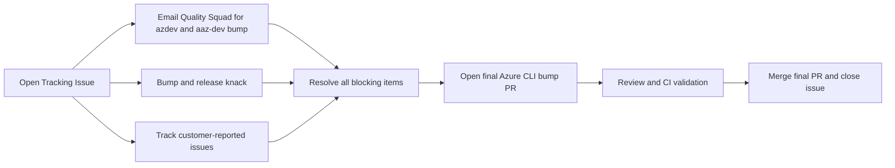

# Azure CLI Python Version Bump Playbook

This is the operational workflow for supporting a new Python minor version in Azure CLI.

## Workflow Overview

## Key Rules

- The tracking issue is the single source of truth.
- After opening the tracking issue, three workstreams run in parallel:
    - Quality Squad bumps `azdev` and `aaz-dev` (coordinate with Ethan)
    - Azure CLI team bumps and releases `knack`
    - Azure CLI team tracks and fixes customer-reported issues
- Customer issues typically appear before official bump merge because users adopt new Python early and run `pip install azure-cli`.
- Opening the final Azure CLI bump PR early as draft is allowed for CI signal.
- Do not merge final bump PR until all tracking issue blockers are closed.
- Extension compatibility gate: Azure CLI CI extension-loading jobs must pass on the target Python version.

## Step-by-Step Process

1. Open and structure the tracking issue.
     - Create Support Python X.Y.
     - Add explicit checklist sections:
         - quality squad: azdev and aaz-dev
         - knack bump and release
         - customer-reported issues on new Python
         - final Azure CLI bump PR

2. Start parallel workstreams after the tracking issue is created.
     - Send email to Quality Squad for azdev and aaz-dev bumping.
     - Coordination point: contact Ethan to align schedule and status for those items.
     - In parallel, bump and release knack (owned by us).
     - In parallel, track customer-reported issues from new Python usage.
     - These reports usually arrive before official bump merge because users test Azure CLI on the new Python early.

3. Burn down blockers in each workstream.
     - Confirm azdev and aaz-dev bumps are completed and consumable.
     - Confirm knack is released, then prepare Azure CLI knack version update.
     - Fix blocking customer-reported regressions before final bump merge.

4. Validate readiness.
     - Verify dependency checklist is complete.
     - Verify customer-facing blockers are resolved or explicitly accepted.
     - Verify CI is healthy for the new Python minor.
     - Verify Azure CLI CI extension-loading jobs pass on the new Python minor to confirm extension compatibility.

5. Open final Azure CLI bump PR.
     - Apply mechanical version updates in Azure CLI.
     - Keep scope tightly focused on version enablement.
     - Preferred in this workflow: open it early as a draft to surface CI failures sooner.
     - Include Azure CLI update to consume the new released knack version.

6. Validate and merge.
     - Complete normal review and CI validation.
     - Merge only after the tracking issue is fully green.

7. Close and document.
     - Close tracking issue after final PR merge.
     - Record short notes for the next Python cycle.

## Python 3.14 Reference (Issue #32869)

Tracking issue:
- Support Python 3.14 (#32869)

Representative linked work:
- Azure CLI final bump PR: [Packaging] Bump Python version to 3.14 (#33313)
- Knack support and follow-ups: microsoft/knack#296, microsoft/knack#300
- Azure CLI knack version bump PR: {Packaging} Bump knack to 0.14.0 (#33377)
- Azdev support: Azure/azure-cli-dev-tools#544, #547
- Additional dependency compatibility and CI fix PRs

Case-study takeaway:
- The final bump merged after dependency readiness and customer issue resolution were in place.
