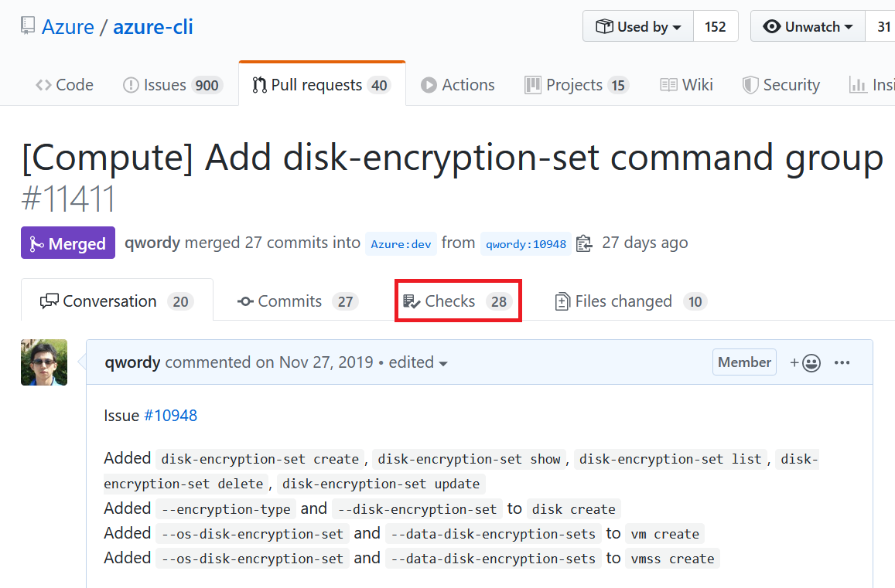

Try new features before release
===

This documentation shows how to try new features in commit or PR before release even if the PR is not merged.

Azure CLI releases new versions every 3 weeks. Many customers and developers are eager to try and test new features before the formal release. Fortunately, Azure CLI project builds artifacts for every commit and PR and you can download them.

## Tutorial for commit

Step 1. Select a commit. Click the √ or × symbol. Click "Details" of a "build package" item.

Step 2. Click "View more details on Azure Pipelines".

Step 3. Click "1 artifact"

Step 4. Download your favorite artifact.

## Tutorial for PR

Step 1. Open a PR no matter it is merged or not. Click "Checks" tab.

Step 2-4. Follow the same steps of tutorial for commit.