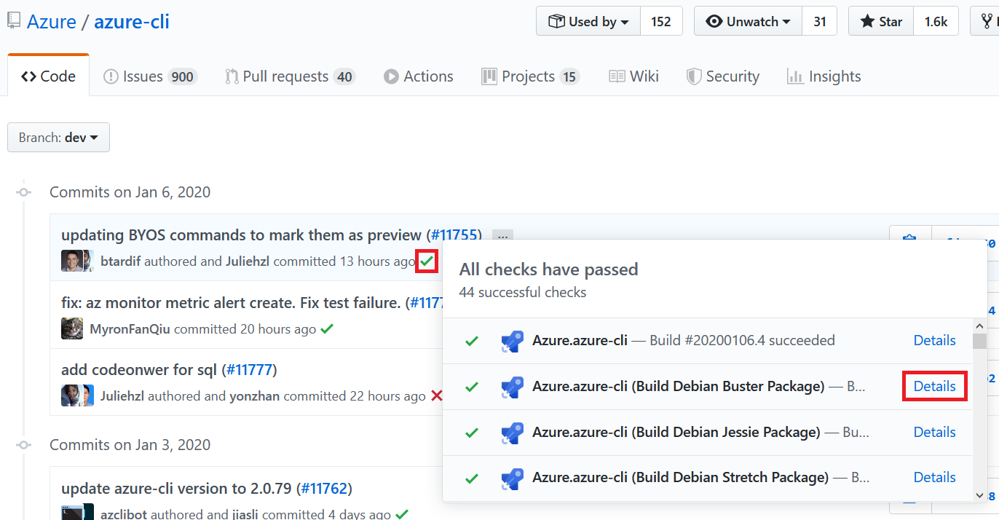
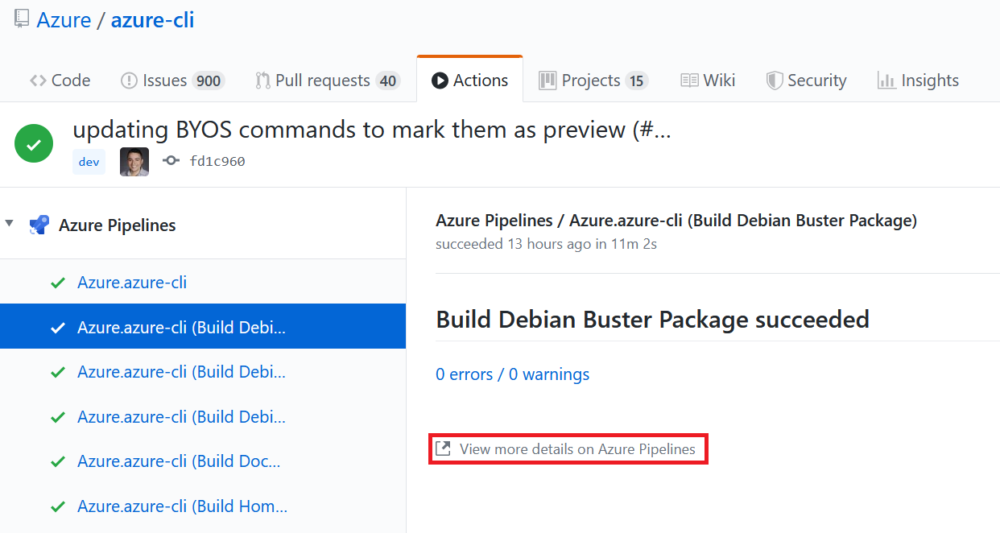
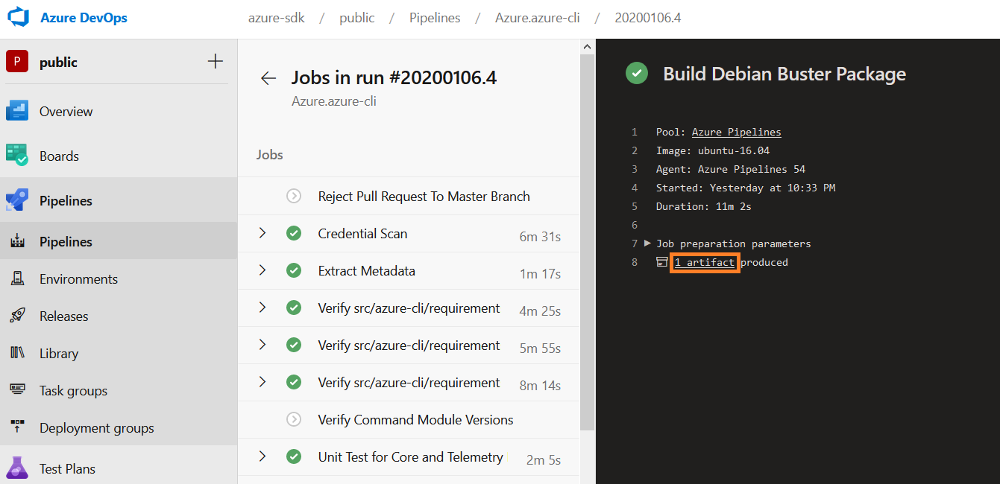

# Try new features before release

This documentation shows how to try new features in commit or PR before release even if the PR is not merged.

Azure CLI releases new versions every 3 weeks. Many customers and developers are eager to try and test new features before the formal release. Fortunately, Azure CLI project builds artifacts for every commit and PR and you can download them.

## Tutorial for commit

Step 1. Select a commit. Click the √ or × symbol. Click "Details" of a "build package" item.



Step 2. Click "View more details on Azure Pipelines".



Step 3. Click "1 artifact"



Step 4. Download your favorite artifact.


## Tutorial for PR

Step 1. Open a PR no matter it is merged or not. Click "Checks" tab.


Step 2-4. Follow the same steps of tutorial for commit.

## When Azure Python SDK is not released

When a feature is in private preview stage, the corresponding Azure Python SDK cannot be released. But you can still try the new feature.

Follow the same steps in previous sessions and find artifact page. Click `pypi` and download all `.whl` files in artifact page. Install it along with the Azure Python SDK. The SDK can be retrieved from Azure SDK team. You can request a release of SDK in https://portal.azure-devex-tools.com/. Since it's in private preview, it cannot be released. You can get a private build instead.


```powershell
pip install azure_cli-2.6.0-py3-none-any.whl azure_cli_command_modules_nspkg-2.0.3-py3-none-any.whl azure_cli_core-2.6.0-py3-none-any.whl azure_cli_nspkg-3.0.4-py3-none-any.whl azure_cli_telemetry-1.0.4-py3-none-any.whl azure_mgmt_imagebuilder-1.0.0-py2.py3-none-any.whl
```
`azure_cli-2.6.0-py3-none-any.whl`, `azure_cli_command_modules_nspkg-2.0.3-py3-none-any.whl`, `azure_cli_core-2.6.0-py3-none-any.whl`, `azure_cli_nspkg-3.0.4-py3-none-any.whl`, `azure_cli_telemetry-1.0.4-py3-none-any.whl` are packages of Azure CLI. `azure_mgmt_imagebuilder-1.0.0-py2.py3-none-any.whl` is a package of Image Builder resource provider. You should change it to your own SDK package containing the new feature.

We recommend using a virtual environment to install the `.whl` files. This is an optional step.
Example commands in PowerShell:

```powershell
# Create a virtual environment 
python -m venv env

# Activate it
env\Scripts\activate.ps1
```

## Install from source code

This approach is for geek users. You can test Azure CLI of any repository, any branch, any commit.

```powershell
# You can also clone a fork of this repository
git clone https://github.com/Azure/azure-cli.git

# You can checkout any branch, any commit
git checkout <branch>/<commit>

# Create a Python virtual environment
# https://docs.python.org/3/using/cmdline.html#cmdoption-m
python -m venv env

# Activate the virtual environment
env\Scripts\activate.ps1

# Install azdev - the development tool for Azure CLI
pip install azdev

# Install dependencies. This may take about 5 minutes
azdev setup -c azure-cli

# Run Azure CLI
az -v
```
