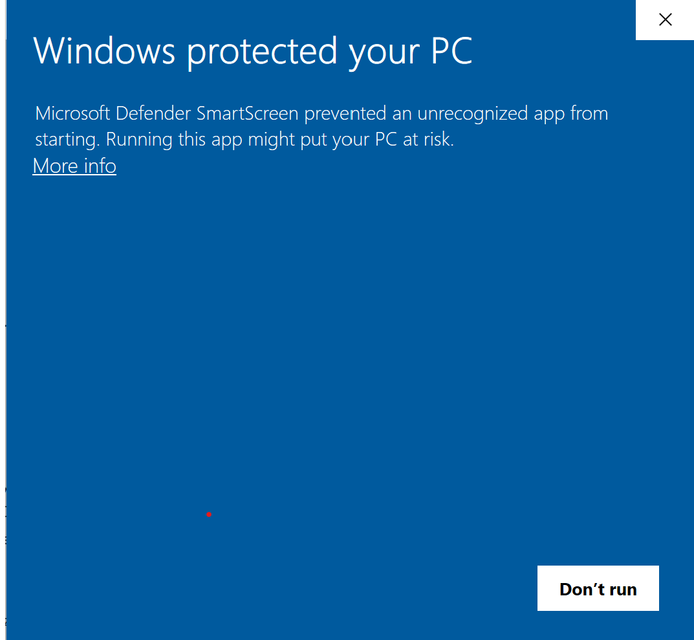
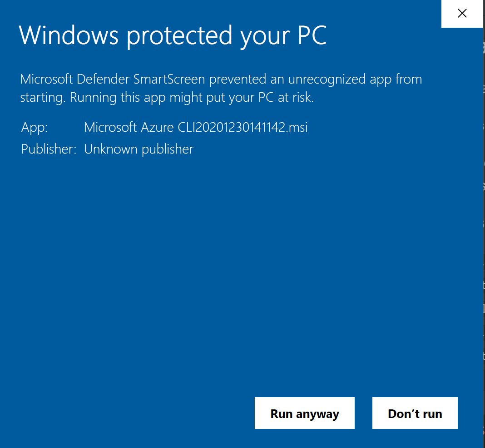

Progress Bar for Long Running Operation
==========================================

## How to try
### Install pricate package
There are two ways to install the private package:
1. Using msi (Windows platform)
    - Click the [link](https://zuhdefault.blob.core.windows.net/cliext/Microsoft%20Azure%20CLI20201230141142.msi) 
    to download the msi
    - Find the msi file and install it. You may see the following page during installation, which is because that 
    current msi hasn't been code signed. 
    
    Please click **More info** and you will see the following information and click **Run anyway** to continue:
    

2. Using pip (All platform including Windows, Linux, Mac)
    - `pip install https://zuhdefault.blob.core.windows.net/cliext/azure_cli-2.17.0.post20201230141142-py3-none-any.whl`
    - `pip install https://zuhdefault.blob.core.windows.net/cliext/azure_cli_core-2.17.0.post20201230141142-py3-none-any.whl`
    
    After installation, run `az --version` and you can see the following information:
    ```
    ❯ az --version
    azure-cli                2.17.0.post20201230141142
    
    core                     2.17.0.post20201230141142
    telemetry                          1.0.6
    ```

### Prepare resource group
`az group create -n mygroup -l eastus`

### Try different progress bar
#### Determinate progress bar
1. Percent progress bar

    `Running [.....     ] 50%`

    Try:
    ```
    az storage account create -g mygroup -n mystorageaccount
    ```

2. Timing progress bar

    ` - This operation usually takes 40 seconds (12 seconds) ..`

    Try:
    ```
    az network lb create -g mygroup -n mylb --sku Basic
    ```

#### Indeterminate progress bar
1. Pong-like progress bar

    `Running |     .     |`

    Try:
    ```
    az vm create -g mygroup -n myvm --image ubuntults
    ```

2. Spinner progress bar

    `| Running ..`

    Try:
    ```
    az network lb delete -g mygroup -n mylb
    ```
    ```
    az vm delete -g mygroup -n myvm
    ```

## How to use
### Configure percent progress bar
```
from azure.cli.core.commands.progress import PercentageProgressBar

g.custom_command('create', 'create_storage_account', progress=PercentageProgressBar(self.cli_ctx, total=20))
```
### Configure timing progress bar
```
from azure.cli.core.commands.progress import TimingProgressBar
g.custom_command('create', 'create_load_balancer', supports_no_wait=True,
                        transform=DeploymentOutputLongRunningOperation(self.cli_ctx),
                        table_transformer=deployment_validate_table_format,
                        validator=process_lb_create_namespace, exception_handler=handle_template_based_exception,
                        progress=TimingProgressBar(self.cli_ctx, total=40))
```
### Configure pong-like progress bar
```
from azure.cli.core.commands.progress import InfiniteProgressBar
g.custom_command('create', 'create_vm',
                        transform=transform_vm_create_output, supports_no_wait=True,
                        table_transformer=deployment_validate_table_format,
                        validator=process_vm_create_namespace,
                        exception_handler=handle_template_based_exception,
                        progress=InfiniteProgressBar(self.cli_ctx))
```

*Note*:
For command including multiple sub-resources and several long-running operations, you need to add progress bar args in each LongRunningOperation as below:
```
LongRunningOperation(cmd.cli_ctx, progress_bar=progress_bar)(client.create_or_update(resource_group_name, deployment_name, deployment))
```
