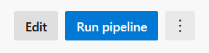

# Use Azure Pipelines to Run Tests

This tutorial shows how to use Azure Pipelines to test Azure CLI commands. The usage may be changed in the future.

## Why you need to run tests

Azure CLI has large number of commands and tests. These tests help guarantee the quality of Azure CLI. Each time an API version or SDK version is upgraded, it is necessary to run all related tests lively to avoid regression error.

## Why you need this pipeline

Running test cases has high cost. Especially when running test cases in local machine, it may block normal work for a long time.
Azure Pipelines is a cloud service that you can use to automatically build and test your code project and make it available to other users.
We have created a pipeline to enable running test cases in Azure platform. By using this pipeline, users can liberate their local machines, test their code easily and view a visualized, beautiful test report.

## Steps

**Step 1.** Open the [pipeline](https://dev.azure.com/azure-sdk/public/_build?definitionId=1369). In the top right corner, there is a "Run pipeline" button. Click it.

**Step 2.** In the pop-up dialog, click "Variables" in "Advanced options"

**Step 3.** In "Variables", you can configure the pipeline run. You can configure where the code is, run test lively or not, what modules to test.

USER_REPO: Repository address. Recommend https instead of git address to avoid possible permission problem. Default value is Azure CLI official repository.

USER_BRANCH: Branch or the repository. Default value is "dev".

USER_TARGET: List of modules to be tested. Values are separated by space. Leave it empty to run all tests. Default value is empty.

USER_LIVE: Whether run test lively. Allowed values are "--live", empty string. "--live" means run test lively. Leave it empty to run test in replay mode.

**Step 4.** Click "<-" icon in the top left corner and then click "Run" button in the bottom right corner. Have a cup of coffee now.

**Step 5.** In the pipeline run detail page, click "Tests" tab. You can view a visualized test report. The report is generated and updated in real time. You do not need to wait till all tests are finished. Explore the test report page by yourself.

If you have any problems when using this pipeline, please open an issue in Azure CLI Github repository.
