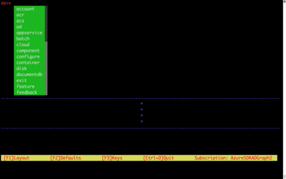

# Azure CLI Interactive Shell

## The interactive shell for Microsoft Azure CLI (Command Line Interface)

- Interactive Tutorials
- Lightweight Drop Down Completions 
- Auto Cached Suggestions 
- Dynamic parameter completion 
- Defaulting scopes of commands
- On the fly descriptions of the commands AND parameters 
- On the fly examples of how to utilize each command 
- Query the previous command
- Navigation of example pane 
- Optional layout configurations 
- Optional "az" component 
- Fun Colors 



## Running

To start the application

```bash
   $ az shell
```

Then type your commands and hit [Enter]

To use commands outside the application

```bash
   $ #[command]
```

To Search through the last command as json
jmespath format for querying

```bash
   $ ? [param]
```

*Note: Only if the previous command dumps out json, e.g. vm list*

To only see the commands for a command

```bash
   $ %% [top-level command] [sub-level command] etc
```

To undefault a value

```bash
   $ %% ..
```

## Use Examples

Type a command, for example:

```bash
   $ vm create
```

Look at the examples

*Scroll through the pane with Control Y for up and Control N for down #*

Pick the example you want with:

```bash
   $ vm create :: [Example Number]
```

## Clear History

```bash
   $ clear-history
```

Only clears the appended suggestion when you restart the shell


## Clear Screen

```bash
   $ clear
```


## Change colors

```bash
   $ az shell --styles [option]
```

The color option will be saved.
